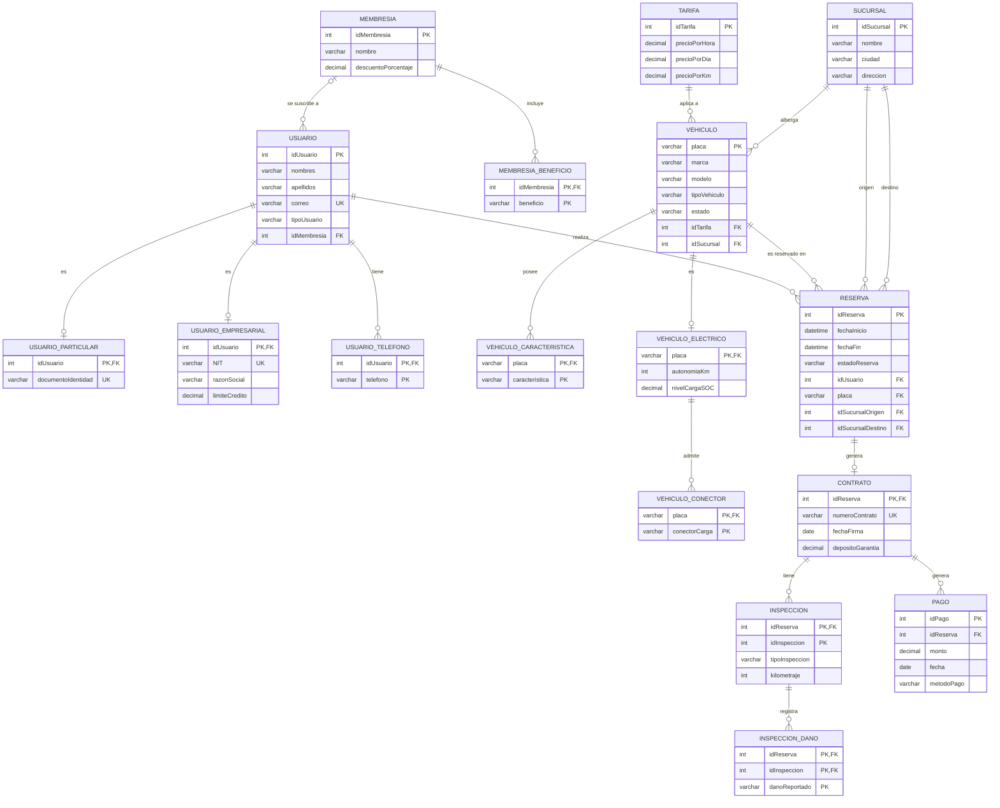

# Modelo Relacional Normalizado (3FN)

**Proyecto:** Plataforma de Gestión de Alquiler de Vehículos  
**Estudiante:** Erick Santiago Rincon Rojas  
**Código:** 01251151002

Gráfico del modelo relacional en tercera forma normal. El proceso de normalización está en [`Informe_Normalizacion.md`](Informe_Normalizacion.md).

## Convenciones

- **PK:** llave primaria. **FK:** llave foránea. **UK:** llave alterna (valor único).
- `||` exactamente uno, `o|` cero o uno, `o{` cero o muchos.
- `USUARIO.idMembresia` admite valor nulo, porque un usuario puede no tener membresía.
- `RESERVA` tiene dos llaves foráneas a `SUCURSAL` (`idSucursalOrigen` e `idSucursalDestino`), por eso aparecen dos líneas entre ambas tablas.
- `INSPECCION_DANO` tiene llave foránea compuesta `(idReserva, idInspeccion)` hacia `INSPECCION`.
- La especialización de `USUARIO` (total y disjunta) y la de `VEHICULO` (parcial y disjunta) se representan con las relaciones `es`.
